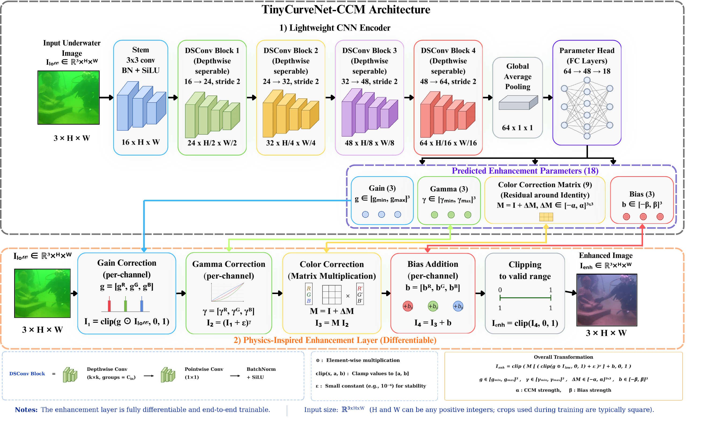
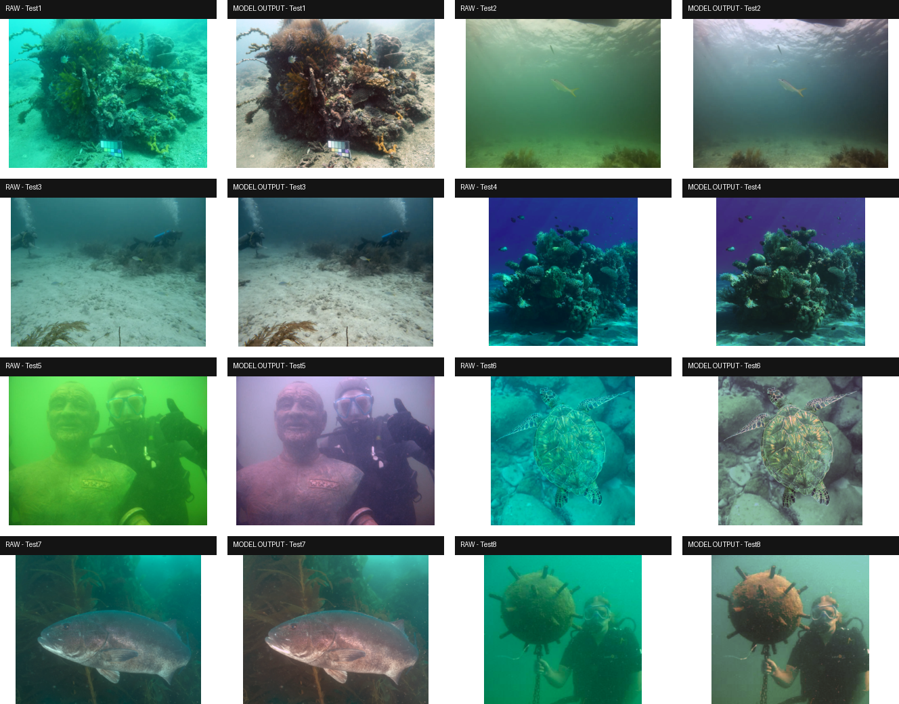

# TinyCurveNet-CCM

Interpretable global underwater image enhancement: predict 18 gain/gamma/colour-matrix/bias values and apply an explicit differentiable transformation.

## Related paper and repositories

**Three Lightweight Architectures for Underwater Image Enhancement: A Quality and Efficiency Study for Real-Time Robotic Perception**
Shahid Ahamed Hasib, Farid Dinar, Yassine Zniyed, Julien Seinturier, and Nadège Thirion-Moreau. Revised manuscript, 2026.

[TinyCurveNet-CCM](https://github.com/ShahidHasib586/TinyCurveNet) · [AquaFastNet](https://github.com/ShahidHasib586/AquaFastNet) · [EdgeOSA](https://github.com/ShahidHasib586/EdgeOSA-Underwater-vsison-Enhancement)

See [paper protocol and reproducibility notes](docs/PAPER.md), [machine-readable results](results/README.md), and [citation metadata](CITATION.cff). No publication venue or DOI is claimed.

## Architecture

The implementation is `src/model.py::TinyCurveCCMNet` (alias `TinyCurveNet`). A 3×3 stem maps RGB to 16 channels; four stride-2 depthwise separable blocks use 24, 32, 48 and 64 channels. Global average pooling and a 64 → 48 → 18 head predict the transform. There are **11,642 trainable parameters** in the released model; **18 is the number of predicted enhancement values**.

```text
z     = clip(g ⊙ I, 0, 1)
u     = (z + 1e-6) ^ gamma
I_enh = clip(M @ u + b, 0, 1)
```

Here, `⊙` and `^` denote element-wise multiplication and exponentiation; `M @ u` applies the 3×3 colour matrix to each pixel's RGB vector. `clip(x, 0, 1)` clamps values to [0, 1].

Gain ∈ [0.6,2.0], gamma ∈ [0.6,2.2], M = I₃ + 0.30 tanh(R), and b = 0.06 tanh(b_raw). This is physics-inspired correction, not inversion of an underwater image-formation model.




## Paper-reported quality

| Evaluation set | Objective / checkpoint | PSNR ↑ | SSIM ↑ | MS-SSIM ↑ | LPIPS ↓ | NIQE ↓ |
|---|---|---:|---:|---:|---:|---:|
| Validation set | Earlier L1-selected checkpoint | 21.7 | 0.9 | 0.93 | 0.16 | — |
| Validation set | Full L1 ablation checkpoint | 21.51 | 0.9 | — | 0.15 | — |
| UIEB test subset | L1; Anticast LPIPS best; epoch 172 | 21.5745 | 0.9059 | 0.9296 | 0.1644 | 4.0039 |
| EUVP Test | L1; Anticast PSNR best; epoch 41 | 19.9283 | 0.8397 | 0.9592 | 0.2764 | 5.4564 |
| EUVP Test | L1; Anticast LPIPS best; epoch 172 | 19.9279 | 0.8379 | 0.958 | 0.276 | 5.444 |
| Validation set | MSE; PSNR-selected checkpoint | 19.93 | 0.87 | — | 0.2 | — |

See Tables V and XXII; validation and test rows must remain distinct.

## Full checkpoint evaluation (Table XXII)

All checkpoint-selection rows from the paper are included below. Identically reported scores are retained under their original checkpoint labels. These named checkpoints have not been identified among the bundled example weights.

| Dataset | Checkpoint | Epoch | L1 ↓ | MSE ↓ | PSNR ↑ | SSIM ↑ | MS-SSIM ↑ | LPIPS ↓ | NIQE ↓ |
| --- | --- | --- | --- | --- | --- | --- | --- | --- | --- |
| UIEB test subset | Polish global best | 19 | .0733 | .00962 | 21.5181 | .9058 | .9294 | .1659 | 4.0106 |
| UIEB test subset | Anticast global best | 41 | .0738 | .00974 | 21.4501 | .9054 | .9284 | .1673 | 4.0161 |
| UIEB test subset | Anticast PSNR best | 41 | .0738 | .00974 | 21.4501 | .9054 | .9284 | .1673 | 4.0161 |
| UIEB test subset | Anticast balanced best | 41 | .0738 | .00974 | 21.4501 | .9054 | .9284 | .1673 | 4.0161 |
| UIEB test subset | Anticast LPIPS best | 172 | .0729 | .00954 | 21.5745 | .9059 | .9296 | .1644 | 4.0039 |
| EUVP Test | Polish global best | 19 | .0908 | .01442 | 19.8472 | .8378 | .9588 | .2773 | 5.4484 |
| EUVP Test | Anticast global best | 41 | .0897 | .01418 | 19.9283 | .8397 | .9592 | .2764 | 5.4564 |
| EUVP Test | Anticast PSNR best | 41 | .0897 | .01418 | 19.9283 | .8397 | .9592 | .2764 | 5.4564 |
| EUVP Test | Anticast balanced best | 41 | .0897 | .01418 | 19.9283 | .8397 | .9592 | .2764 | 5.4564 |
| EUVP Test | Anticast LPIPS best | 172 | .0900 | .01427 | 19.9279 | .8379 | .9580 | .2760 | 5.4440 |

## Paper-reported runtime

RTX 3070, 228 images, saving disabled; Tables XV–XIX.

| Measurement | Latency (ms/image) | FPS |
|---|---:|---:|
| Single-image model-only | 2.37 | 422.01 |
| Single-image standard pipeline | 27.18 | 36.78 |
| Single-image optimized pipeline | 11.97 | 83.51 |
| Batch model-only | 0.41 | 2465.54 |
| Batch standard pipeline | 25.61 | 39.04 |
| Batch optimized pipeline | 4.95 | 201.45 |

**Model-only means parameter prediction only.** The complete pipeline also applies gain, gamma, CCM and bias.

## Paper-reported component ablations

Source: Table XXI. These are manuscript results; the repository does not bundle every ablation checkpoint.

| Variant | Epoch | PSNR ↑ | SSIM ↑ | LPIPS ↓ |
| --- | --- | --- | --- | --- |
| Only gain and gamma | 193 | 20.88 | 0.89 | 0.17 |
| Without gain | 167 | 21.34 | 0.89 | 0.16 |
| Without gamma | 193 | 20.83 | 0.86 | 0.17 |
| Without CCM | 193 | 20.96 | 0.89 | 0.17 |
| Without bias | 369 | 21.65 | 0.90 | 0.16 |
| Full L1 | 174 | 21.51 | 0.90 | 0.15 |
| Full MSE | 12 | 19.93 | 0.87 | 0.20 |

## Paper-reported no-reference quality

Table XIII uses locally prepared subsets and a specific UIQM/UCIQE implementation. These scores must not be mixed with the internal scales in Table V.

| Subset | UIQM ↑ | UCIQE ↑ |
| --- | --- | --- |
| UIEB-C60 | 3.03 | 0.22 |
| EUVP-T515 | 3.36 | 0.27 |
| SQUID-T16 | 2.90 | 0.25 |
| RUIE-T78 | 2.80 | 0.19 |

Table XIV reports a separate general perceptual evaluation; its dataset labels and NIQE values are kept separate from the paired evaluation above.

| Dataset | NIQE ↓ | BRISQUE ↓ | PIQE ↓ |
| --- | --- | --- | --- |
| UIEB | 5.20 | 34.28 | 49.99 |
| EUVP | 5.16 | 22.42 | 30.11 |
| SQUID | 7.14 | 33.64 | 31.23 |
| RUIE | 4.94 | 34.64 | 33.94 |

## Setup and usage

```bash
python -m pip install -r requirements.txt
python src/test_custom_data.py --model checkpoints/stage_05_best.pt \
  --input /path/to/images --output outputs/enhanced \
  --device cpu --infer-size 128 --output-size 512 --save-format png
```

Use `--device cuda:0 --amp` for GPU inference. This utility predicts global parameters on a resized input and applies them at the output resolution; its default resolution is a demo setting, not proof of the paper benchmark configuration. Checkpoint keys must match strictly.

### Training

Edit paired directories in `configs/paper_progressive.yaml` (matching filenames, RGB input/reference). Then run:

```bash
python src/train.py --config configs/paper_progressive.yaml --out runs/paper_composite
python src/train.py --config configs/paper_l1.yaml --out runs/paper_l1
python src/train.py --config configs/paper_mse.yaml --out runs/paper_mse
```

The five paper stages use crops [256,320,384,448,512] and 120 epochs/stage. Batch sizes and learning rates in these example configs come from the released five-stage config, not a complete paper run log. The manuscript separately describes an 800-epoch stage-3 continuation; the existing `configs/progressive.yaml` is an 820-epoch, crop-384 experiment and is not relabelled as that exact run.

The default composite loss is L1 + 0.20(1−SSIM) + 0.05 LPIPS(VGG), with gradients through SSIM/LPIPS. `loss.objective` selects `composite`, `l1` or `mse`. Use separate `--out` directories: the trainer resumes a `latest.pt` inside that run. `src/train_progressive.py` now delegates to this corrected trainer. Paired crops/flips share coordinates, and validation L1 is normalized per pixel.

The stage/example checkpoints are available in `checkpoints/`; the Table XXII Anticast/Polish checkpoints are not identified there. Full training/evaluation may download pretrained perceptual-metric weights. Legacy UIQM/UCIQE helpers are internal-scale approximations, not interchangeable with canonical implementations.

## Repository contents

Training, inference, metric evaluation, original split manifests (where available), unique checkpoints, configuration examples, tests and paper-result CSVs are retained. Architecture figures and one compact qualitative preview (where available) support inspection. See [cleanup and checkpoint notes](docs/CLEANUP.md) for removed files and recovery information.

## Interpretation and limitations

Reported values are from the revised manuscript, not new measurements. Dataset splits and checkpoint selection differ across some experiments. The runtime platform was an RTX 3070 desktop GPU; embedded validation and downstream robotic-task benefits remain future work. Existing checkpoints are preserved, and their exact mapping to paper rows is not assumed. Read [the audit notes](docs/PAPER.md) before reproducing or comparing results.

## Validation

```bash
python -m unittest discover -s tests -v
```

Tests cover checkpoint compatibility, image shape/range and differentiable objectives; TinyCurveNet also checks paired augmentation alignment. They do not reproduce manuscript scores or GPU timings.

## License

Apache License 2.0. Copyright 2026 Shahid Ahamed Hasib. See [LICENSE](LICENSE).
